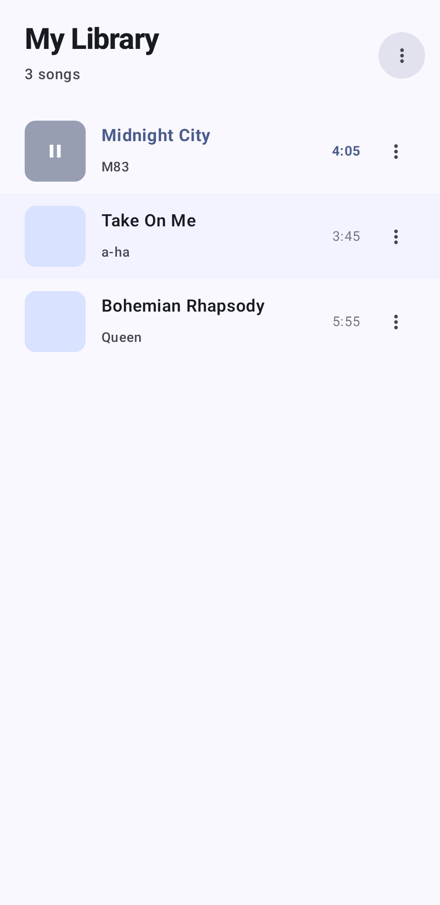
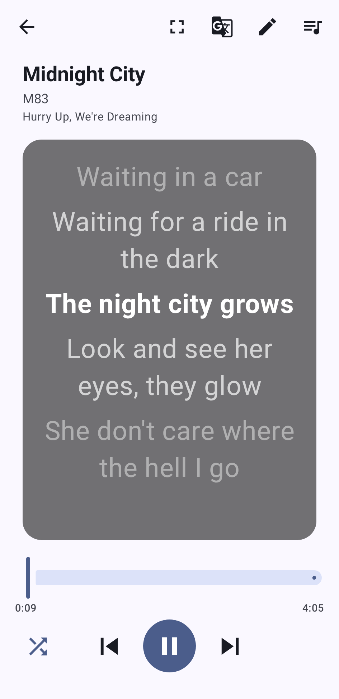
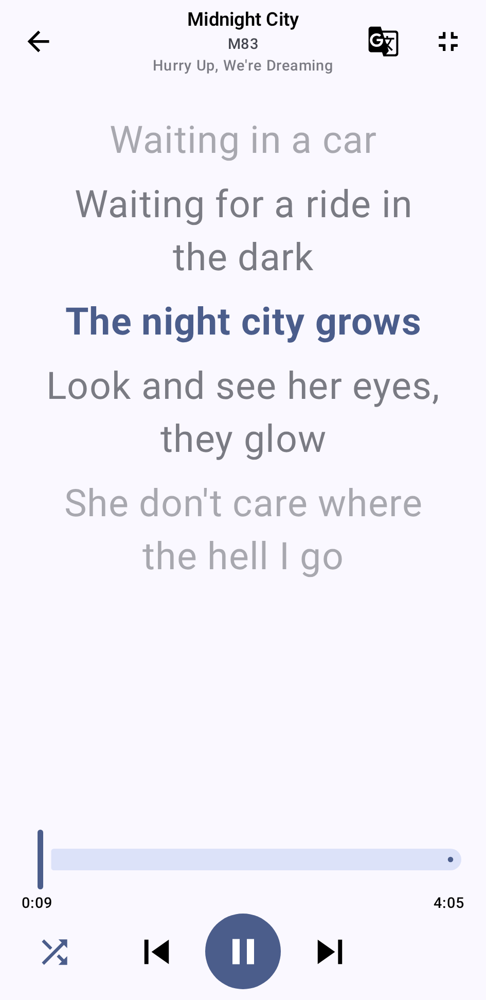
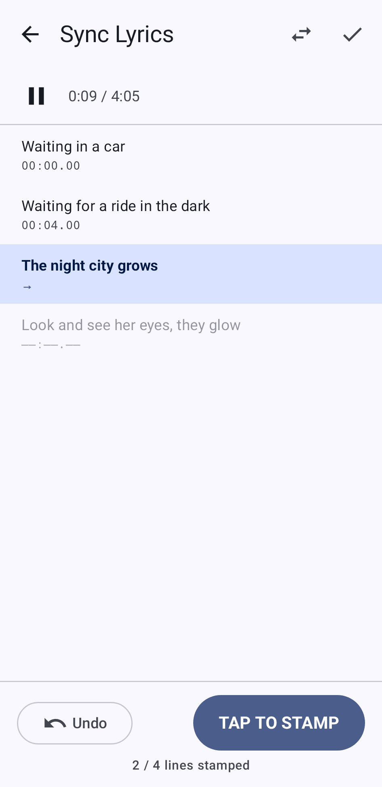
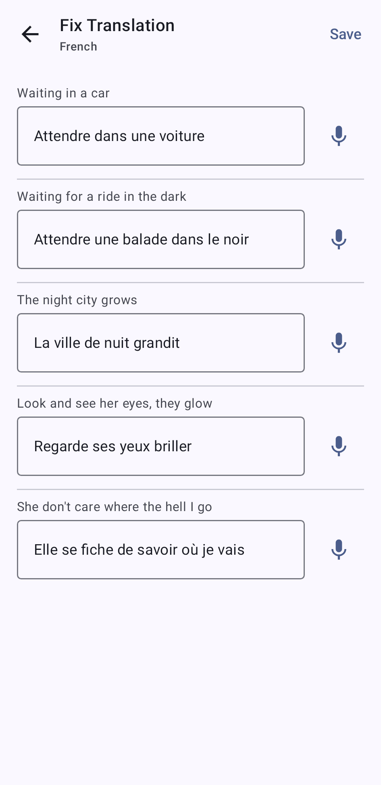
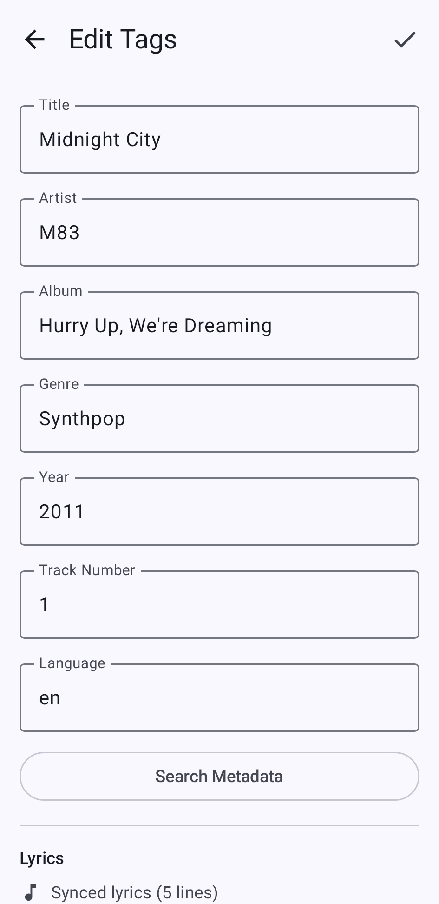
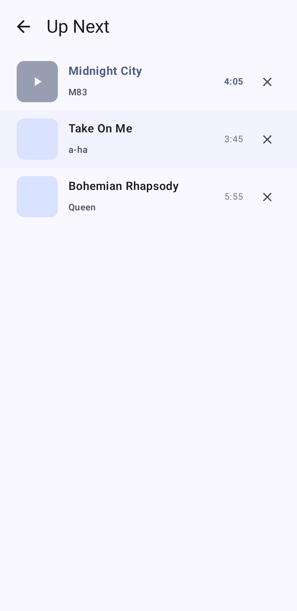
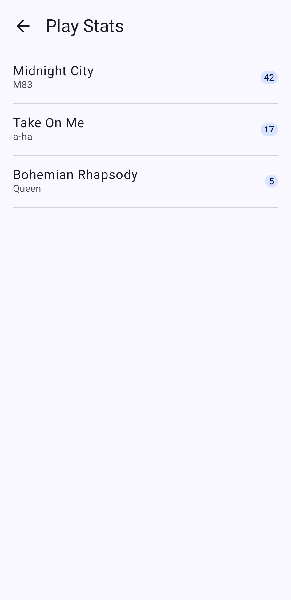
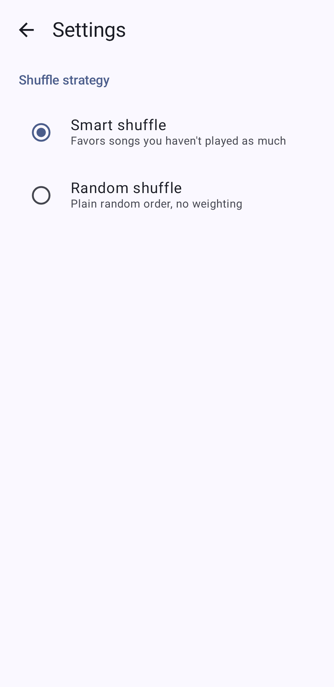

# PaperPlayer

A local music player for Android focused on synced lyrics — with built-in support for contributing lyrics back to the community.

## Features

- Plays local music from your device storage
- Displays synced lyrics with auto-scroll, highlighted line-by-line
- Fetches synced lyrics from [lrclib.net](https://lrclib.net) when not embedded in the file
- **Contribute lyrics** — submit synced lyrics directly from the app back to lrclib for everyone to use
- Background playback with media notification controls
- Album art display

## Screens

| Library | Player | Fullscreen lyrics |
|:---:|:---:|:---:|
|  |  |  |

| Lyrics editor | Translation editor | Tag editor |
|:---:|:---:|:---:|
|  |  |  |

| Queue | Play stats | Settings |
|:---:|:---:|:---:|
|  |  |  |

Previews are rendered from Compose `@Preview` fixtures by the [Screenshots workflow](.github/workflows/screenshots.yml) (`./gradlew updateDebugScreenshotTest`), not captured from a device.

## Tech Stack

- Kotlin + Jetpack Compose
- Media3 ExoPlayer for playback
- MediaSessionService for background playback
- JAudioTagger for reading embedded ID3 lyrics (SYLT/USLT)
- lrclib.net API for fetching and publishing synced lyrics

## Requirements

- Android 8.0 (API 24) or higher

## Building

1. Clone the repo
2. Open in Android Studio
3. Sync Gradle and run on a device or emulator

## Status

Early MVP — core playback and lyrics sync are working. Actively adding features.

## License

MIT
